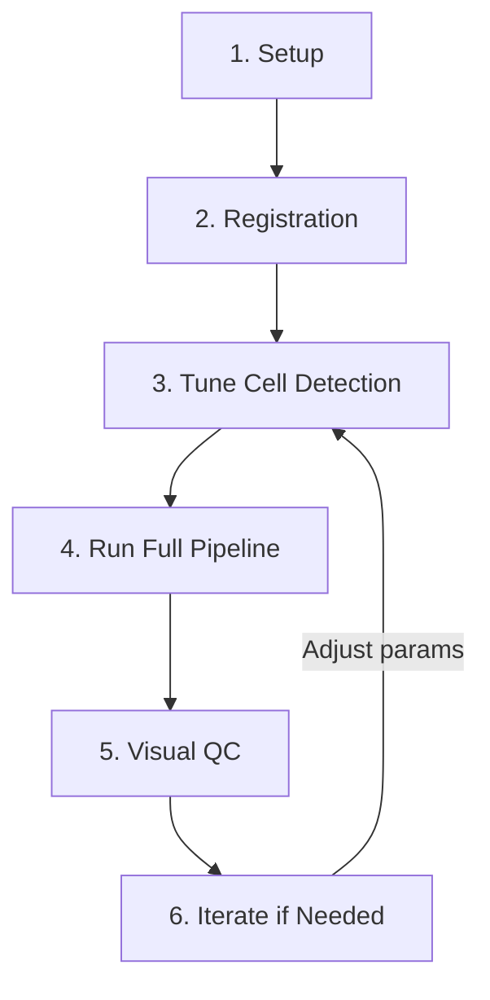

# CellCounter

> Automated cFos-positive cell counting and brain region mapping for whole-brain microscopy images.

[](https://tlee08.github.io/cellcounter/)
[](https://www.gnu.org/licenses/gpl-3.0)

---

## What is CellCounter?

CellCounter is a Python tool designed for **neuroscientists** who need to:

1. **Detect and count cFos-positive cells** in whole-brain microscopy images (typically ~90GB per brain)
2. **Map those cells to anatomical brain regions** using the Allen Mouse Brain Atlas
3. **Register images** to a common reference space for comparison across animals

### Who is this for?

- Researchers studying neural activity via cFos immunostaining
- Labs doing whole-brain imaging (light sheet microscopy, serial two-photon, etc.)
- Anyone needing automated, reproducible cell counting across brain regions

**No programming experience required** — the tool provides command-line scripts and pre-made templates you can customize.

---

## Quick Overview

```
┌─────────────────┐     ┌─────────────┐     ┌─────────────────┐
│  TIFF Images    │────▶│ Registration│────▶│  Aligned Image  │
│  (your data)    │     │  to Atlas   │     │  (atlas space)  │
└─────────────────┘     └─────────────┘     └─────────────────┘
         │                                               │
         │                                               ▼
         ▼                                     ┌─────────────────┐
┌─────────────────┐     ┌─────────────┐         │  Cell-to-Region │
│  Cell Detection │────▶│  Watershed  │────────▶│     Mapping     │
│  (filtering +   │     │ Segmentation│         │                 │
│   thresholding) │     │             │         │  CSV Results :  │
└─────────────────┘     └─────────────┘         │  region, count, │
                                                │  intensity      │
                                                └─────────────────┘
```

---

## Installation

### Prerequisites

- **Python 3.12** (exact version required)
- **[uv](https://docs.astral.sh/uv/)** — a fast Python package manager
- **(Recommended)** NVIDIA GPU with CUDA support for processing large images

### Step 1: Install System Dependencies (Ubuntu/Debian)

```bash
# Install build tools
sudo apt update
sudo apt install build-essential python3-dev

# For GPU support: install NVIDIA drivers and CUDA
# See: https://developer.nvidia.com/cuda-downloads
nvidia-smi  # Verify GPU is detected
nvcc --version  # Verify CUDA is installed
```

### Step 2: Install CellCounter

```bash
# Clone the repository
git clone https://github.com/tlee08/cellcounter.git
cd cellcounter

# Install dependencies
uv sync

# Optional: Install GPU support (recommended for large images)
uv sync --extra gpu
```

### Step 3: Download Reference Atlas

The Allen Mouse Brain Atlas is required for registration:

```bash
uv run cellcounter-init
```

This downloads the reference brain atlas (~3GB) needed to align your images.

---

## Quick Start

### 1. Create a New Project

```bash
# Create a new analysis project
cd /path/to/your/experiment/folder
uv run cellcounter-make-project
```

This creates:
```
my_project/
├── config.json          # All parameters (edit this!)
└── cellcount/           # Where outputs will be saved
```

### 2. Configure Parameters

Edit `config.json` or update programmatically:

```python
from cellcounter import Pipeline

pipeline = Pipeline("/path/to/my_project")

# Adjust for your image orientation and size
pipeline.update_config(
    registration={
        "ref_orientation": {"z": -2, "y": 3, "x": 1},  # Match your image axes
        "downsample_rough": {"z": 3, "y": 6, "x": 6},   # Adjust for your resolution
    },
    cell_counting={
        "tophat_radius": 10,       # Background removal radius
        "threshd_value": 60,       # Detection threshold (tune this!)
        "min_wshed_size": 1,       # Minimum cell size (voxels)
        "max_wshed_size": 700,     # Maximum cell size (voxels)
    },
)
```

### 3. Run the Pipeline

```python
from cellcounter import Pipeline

pipeline = Pipeline("/path/to/my_project")

# Run everything at once
pipeline.run_pipeline("/path/to/your/image.tiff")

# Or run step by step for more control:
pipeline.tiff2zarr("/path/to/your/image.tiff")     # Convert to efficient format
pipeline.reg_ref_prepare()                          # Prepare atlas
pipeline.reg_img_rough()                            # Downsample image
pipeline.reg_img_fine()                             # Fine downsample
pipeline.reg_img_trim()                             # Trim to region
pipeline.reg_img_bound()                            # Clip intensity
pipeline.reg_elastix()                              # Register to atlas
pipeline.make_tuning_arr()                          # Create tuning subset

# Cell counting (tune on small subset first!)
pipeline.tophat_filter()
pipeline.dog_filter()
pipeline.adaptive_threshold_prep()
pipeline.threshold()
# ... see full pipeline for remaining steps
```

### 4. Check Results

Results are saved in `cellcount/cells_agg.csv`:

| region_id | region_name | cell_count | avg_intensity | volume |
|-----------|-------------|------------|---------------|--------|
| 1         | isocortex   | 1523       | 245.3         | 6.2    |
| 2         | hippocampus | 892        | 198.7         | 3.8    |
| ...       | ...         | ...        | ...           | ...    |

---

## Documentation

📚 **[Full Documentation](https://tlee08.github.io/cellcounter/)**

- **Tutorials**: Learn cell counting step-by-step
  - [Installation Guide](https://tlee08.github.io/cellcounter/tutorials/installation/)
  - [Quick Start Tutorial](https://tlee08.github.io/cellcounter/tutorials/quickstart/)

- **How-To Guides**: Solve specific problems
  - [Batch Processing Multiple Images](https://tlee08.github.io/cellcounter/how-to/batch/)
  - [Configuring Parameters](https://tlee08.github.io/cellcounter/how-to/configuration/)
  - [Visual Quality Control](https://tlee08.github.io/cellcounter/how-to/visual-check/)

- **Explanation**: Understanding the system
  - [Architecture Overview](https://tlee08.github.io/cellcounter/explanation/architecture/)
  - [Cell Detection Algorithm](https://tlee08.github.io/cellcounter/explanation/cell-detection/)

- **API Reference**: Technical details
  - [Pipeline API](https://tlee08.github.io/cellcounter/reference/pipeline/)
  - [Configuration Reference](https://tlee08.github.io/cellcounter/reference/config/)

---

## Key Features

| Feature | Description |
|---------|-------------|
| **GPU Acceleration** | Process ~90GB images using CUDA (CuPy) |
| **Memory Efficient** | Chunked processing via Dask — no need to load entire image into RAM |
| **Reproducible** | All parameters saved in `config.json`; every run documented |
| **Customizable** | Tune detection parameters for your specific staining and resolution |
| **Visual QC** | Built-in tools to verify registration and cell detection |
| **Batch Processing** | Process many brains with consistent parameters |

---

## Recommended Workflow

For best results, follow this workflow:



### 1. Setup
- Install software
- Download atlas (`cellcounter-init`)
- Create project (`cellcounter-make-project`)

### 2. Registration (run once per brain)
- Convert TIFF to Zarr
- Prepare reference atlas
- Run registration steps
- **Verify**: Use `VisualCheck.combine_reg()` to check alignment

### 3. Tune Cell Detection
- Use small crop (`tuning=True`) for fast iteration
- Adjust `threshd_value` and size filters
- **Verify**: Use `VisualCheck.combine_cellc()` to see detected cells

### 4. Run Full Pipeline
- Process entire image (`tuning=False`)
- Map cells to brain regions
- Export CSV results

---

## Getting Help

- 📖 **[Documentation](https://tlee08.github.io/cellcounter/)** — Start here
- 🐛 **[Issues](https://github.com/tlee08/cellcounter/issues)** — Report bugs or request features
- 💬 **Questions?** Open a discussion on GitHub

---

## Citation

If you use CellCounter in your research, please cite:

```bibtex
@software{cellcounter,
  title = {CellCounter: Automated cFos Cell Counting for Whole-Brain Microscopy},
  author = {BowenLab},
  url = {https://github.com/tlee08/cellcounter},
  license = {GPL-3.0}
}
```

---

## License

This project is licensed under the GNU General Public License v3.0 — see [LICENSE](LICENSE) for details.
