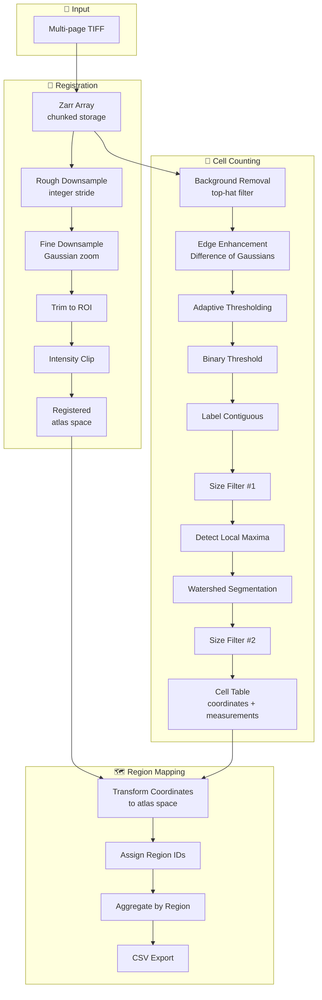

# Architecture

Understanding how CellCounter is organized and how the pieces fit together.

---

## Why This Architecture?

CellCounter is designed for **whole-brain microscopy images** that are:
- **Very large**: ~90GB per brain
- **High resolution**: often 1-2 µm per voxel
- **Compute-intensive**: registration, filtering, segmentation

The architecture addresses these challenges through:
1. **Chunked storage** (Zarr) — memory-efficient access
2. **Lazy evaluation** (Dask) — compute only what's needed
3. **GPU acceleration** (CuPy) — fast array operations
4. **Modular design** — easy to extend and maintain

---

## Directory Structure

```
src/cellcounter/
├── pipeline/               # Main workflow orchestration
│   ├── abstract_pipeline.py   # Base class with GPU/CPU switching
│   ├── pipeline.py            # Full pipeline implementation
│   └── visual_check.py        # QC visualization tools
│
├── models/                 # Data models (Pydantic)
│   ├── proj_config.py         # Configuration tree root
│   ├── proj_config/           # Config sub-models
│   │   ├── cell_counting_config.py
│   │   ├── registration_config.py
│   │   └── ...
│   └── fp_models/             # Filepath models
│       ├── proj_fp.py
│       ├── ref_fp.py
│       └── ...
│
├── funcs/                  # Core algorithms
│   ├── cpu_cellc_funcs.py     # CPU cell counting functions
│   ├── gpu_cellc_funcs.py     # GPU-accelerated wrappers
│   ├── elastix_funcs.py       # Image registration
│   ├── map_funcs.py           # Region mapping
│   ├── io_funcs.py            # File I/O
│   └── ...
│
├── constants/              # Enums and constants
│   ├── annotations.py
│   ├── coords.py
│   └── ...
│
├── utils/                  # Utilities
│   ├── dask_utils.py          # Dask cluster helpers
│   ├── viewer.py              # Napari viewer
│   ├── union_find.py          # Cross-chunk label merging
│   └── ...
│
├── scripts/                # CLI entry points
│   ├── init.py                # Download atlas
│   └── make_project.py        # Create new project
│
└── templates/              # User templates
    ├── run_pipeline.py
    └── view_img.py
```

---

## Design Patterns

### 1. GPU/CPU Backend Switching

**Problem**: Need to support both GPU (fast) and CPU (portable) execution.

**Solution**: Injectable backend with runtime switching.

```python
# Base class uses numpy by default
class CpuCellcFuncs:
    def __init__(self, xp=np, xdimage=scipy.ndimage):
        self.xp = xp  # numpy or cupy
        # All methods use self.xp instead of np directly

# GPU wrapper inherits and converts
class GpuCellcFuncs(CpuCellcFuncs):
    _GPU_METHODS = ["tophat_filt", "dog_filt", ...]
    # Returns cupy arrays → auto-converts to numpy
```

**Usage**:

```python
pipeline = Pipeline("/path/to/project")

# Switch at runtime
pipeline.set_gpu(enabled=True)   # Use CuPy
pipeline.set_gpu(enabled=False)  # Use NumPy
```

This enables:
- Same code runs on both GPU and CPU
- Easy fallback when GPU unavailable
- Easy testing and debugging on CPU

---

### 2. File Protection with Overwrite Guard

**Problem**: Expensive computations shouldn't be accidentally overwritten.

**Solution**: Decorator that checks for existing files.

```python
def _check_overwrite(*fp_attrs: str):
    """Decorator to skip if outputs exist."""
    def decorator(func):
        def wrapper(self, *args, overwrite: bool = False, **kwargs):
            if not overwrite:
                for attr in fp_attrs:
                    fp = getattr(self.pfm, attr)
                    if fp.exists():
                        logger.warning(
                            "Output exists, skipping. "
                            "Use overwrite=True to recompute."
                        )
                        return None
            return func(self, *args, **overwrite, **kwargs)
        return wrapper
    return decorator

class Pipeline:
    @_check_overwrite("downsmpl1")
    def reg_img_rough(self, *, overwrite: bool = False):
        # Won't recompute unless overwrite=True
        ...
```

Benefits:
- Safe to re-run scripts
- Explicit control over recomputation
- Prevents accidental data loss

---

### 3. Dask Cluster Context Managers

**Problem**: Different operations need different compute resources.

**Solution**: Cluster factory methods with context managers.

```python
class AbstractPipeline:
    def gpu_cluster(self):
        """Single GPU worker for GPU ops."""
        return LocalCUDACluster(n_workers=1)

    def heavy_cluster(self):
        """Few workers, high memory for watershed."""
        return LocalCluster(
            n_workers=1,
            threads_per_worker=6
        )

    def busy_cluster(self):
        """Many workers for I/O."""
        return LocalCluster(
            n_workers=4,
            threads_per_worker=1
        )
```

**Usage**:

```python
from cellcounter.utils.dask_utils import cluster_process

with cluster_process(self.gpu_cluster()):
    result = da.map_blocks(self.cellc_funcs.tophat_filt, arr)
    disk_cache(result, output_path)
# Cluster automatically cleaned up
```

Benefits:
- Appropriate resources for each operation
- Automatic cleanup
- No resource conflicts

---

### 4. Configuration as Code

**Problem**: Many parameters need to be saved, versioned, and shared.

**Solution**: Pydantic models with JSON serialization.

```python
class ProjConfig(BaseModel):
    chunks: DimsConfig
    cell_counting: CellCountingConfig
    registration: RegistrationConfig
    ...

    def write_file(self, fp: Path) -> None:
        with fp.open("w") as f:
            f.write(self.model_dump_json(indent=2))

    @classmethod
    def read_file(cls, fp: Path) -> Self:
        return cls.model_validate(json.load(f.open()))
```

Benefits:
- Type-safe configuration
- Auto-validation on load
- Human-readable JSON format
- Easy to version control

---

### 5. Filepath Models

**Problem**: Many files to track across project structure.

**Solution**: Dataclass models for file paths.

```python
@dataclass
class ProjFp:
    root_dir: Path

    @property
    def config_fp(self) -> Path:
        return self.root_dir / "config.json"

    @property
    def raw(self) -> Path:
        return self.cellcount_dir / "raw.zarr"

    @property
    def cells_agg_csv(self) -> Path:
        return self.cellcount_dir / "cells_agg.csv"
```

Benefits:
- Centralized path management
- Consistent naming
- Auto-created directories
- Type hints for autocomplete

---

## Data Flow

The pipeline processes data in three stages:



---

## Memory Management

Whole-brain images (~90GB) can't fit in RAM. Solutions:

### 1. Zarr Chunked Storage

```
raw.zarr/
├── .zarray          # Array metadata
├── 0.0.0            # Chunk (z=0-500, y=0-500, x=0-500)
├── 0.0.1            # Chunk (z=0-500, y=0-500, x=500-1000)
└── ...              # ~150 chunks for whole brain
```

- Only load chunks being processed
- Parallel read/write
- Efficient for both SSD and network storage

### 2. Dask Lazy Evaluation

```python
# Doesn't load data yet — just builds task graph
raw_arr = da.from_zarr("raw.zarr")
filtered = da.map_blocks(tophat_filt, raw_arr)

# Only compute when needed
disk_cache(filtered, "output.zarr")  # Materializes
```

Benefits:
- No intermediate arrays in memory
- Task optimization before execution
- Automatic parallelism

### 3. GPU Single-Worker

```python
with cluster_process(self.gpu_cluster()):
    # n_workers=1 prevents GPU OOM
    result = da.map_blocks(gpu_operation, arr)
```

GPU memory is limited — single worker ensures:
- Only one chunk on GPU at a time
- No contention for VRAM
- Predictable memory usage

### 4. Union-Find for Cross-Chunk Merging

When labeling connected components across chunks:

```python
def _spatial_connect_count(self, label_arr):
    # 1. Find connections at chunk boundaries
    pairs = find_boundary_pairs(label_arr)

    # 2. Union-Find merges labels
    uf = UnionFind()
    for a, b in pairs:
        uf.union(a, b)

    # 3. Map to unified labels
    return uf.remap(label_arr)
```

This ensures cells spanning multiple chunks are counted once.

---

## Extending CellCounter

### Add a New Pipeline Step

```python
class Pipeline:
    @_check_overwrite("new_output")
    def my_new_step(self, *, overwrite: bool = False):
        """Custom processing step."""
        with cluster_process(self.gpu_cluster()):
            raw = da.from_zarr(self.pfm.raw)
            result = da.map_blocks(my_custom_func, raw)
            disk_cache(result, self.pfm.my_new_output)
```

### Add a New Cell Counting Function

```python
class CpuCellcFuncs:
    def my_filter(self, arr: np.ndarray) -> np.ndarray:
        """Custom filter implementation."""
        return self.xp.some_operation(arr)

class GpuCellcFuncs(CpuCellcFuncs):
    _GPU_METHODS = [..., "my_filter"]  # Auto-GPU support
```

### Custom Configuration

```python
class MyConfig(BaseModel):
    my_param: float = 1.0

class ProjConfig(BaseModel):
    ...
    my_config: MyConfig = MyConfig()
```

---

## Testing Architecture

The modular design enables testing at multiple levels:

| Level | What to Test | Example |
|-------|--------------|---------|
| Unit | Individual functions | `test_tophat_filter()` |
| Integration | Pipeline steps | `test_registration_flow()` |
| End-to-end | Full pipeline | `test_small_image()` |

### Mock GPU for Testing

```python
def test_cell_counting_cpu():
    pipeline = Pipeline("/tmp/test", tuning=True)
    pipeline.set_gpu(enabled=False)  # Force CPU
    pipeline.tophat_filter()
    # ... asserts
```

---

## Performance Considerations

| Operation | Bottleneck | Optimization |
|-----------|------------|--------------|
| TIFF→Zarr | Disk I/O | SSD, parallel writing |
| Registration | Elastix | Multi-thread elastix |
| Top-hat | GPU memory | Right-sized chunks |
| Watershed | Memory | Single worker, CPU |
| CSV export | Aggregation | Parquet intermediate |

The architecture separates these concerns so each can be optimized independently.
