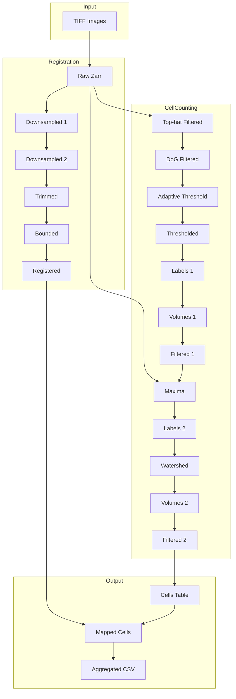

# Architecture

Understanding the cellcounter codebase.

## Directory Structure

```
src/cellcounter/
├── pipeline/
│   ├── abstract_pipeline.py  # Base class with GPU/CPU switching
│   ├── pipeline.py           # Main pipeline orchestrator
│   └── visual_check.py       # Visual QC tools
├── models/
│   ├── proj_config.py        # Pydantic config model
│   └── fp_models/            # Filepath models
├── funcs/
│   ├── cpu_cellc_funcs.py    # CPU cell counting (injectable backend)
│   ├── gpu_cellc_funcs.py    # GPU wrapper (inherits from CPU)
│   ├── reg_funcs.py          # Registration functions
│   ├── map_funcs.py          # Region mapping
│   ├── elastix_funcs.py      # Elastix wrappers
│   └── io_funcs.py           # File I/O
├── constants/                # Enums and constants
├── utils/                    # Dask, logging, viewer, union-find
├── scripts/                  # CLI entry points
├── gui/                      # Streamlit GUI
└── templates/                # User-facing script templates
```

## Key Patterns

### GPU/CPU Switching

The pipeline supports runtime switching between GPU (CuPy) and CPU (NumPy) backends:

```python
# AbstractPipeline provides this
pipeline.set_gpu(enabled=True)   # Use CuPy
pipeline.set_gpu(enabled=False)  # Use NumPy
```

Implementation uses injectable backend:

```python
class CpuCellcFuncs:
    def __init__(self, xp=np, xdimage=scipy.ndimage):
        self.xp = xp  # numpy or cupy
        # All methods use self.xp instead of np
```

GPU wrapper inherits and auto-converts:

```python
class GpuCellcFuncs(CpuCellcFuncs):
    # Methods returning cupy arrays → auto-convert to numpy
    _GPU_METHODS = ["tophat_filt", "dog_filt", ...]
```

### Overwrite Guard

All pipeline methods use `@_check_overwrite` decorator:

```python
@_check_overwrite("raw", "bgrm")
def tophat_filter(self, *, overwrite: bool = False) -> None:
    # Skips if output exists and overwrite=False
    # Logs warning and returns early
```

### Dask Cluster Context

```python
with cluster_process(self.gpu_cluster()):
    result = da.map_blocks(...)
    disk_cache(result, output_path)
```

### ProjConfig Pattern

```python
# Load or create config
config = ProjConfig.ensure(config_fp)

# Update and save
config = config.update(cell_counting={"tophat_radius": 15})
config.write_file(config_fp)
```

## Data Flow



## Memory Management

Large images (~90GB) require careful memory handling:

1. **Chunked Zarr** - Images stored as chunks (default 500³)
2. **Dask lazy evaluation** - Operations computed on-demand
3. **Disk caching** - Intermediate results written to disk
4. **GPU clusters** - Single GPU worker to avoid OOM
5. **Union-Find** - Efficient cross-chunk label merging

## Extension Points

- **Custom cell counting**: Subclass `CpuCellcFuncs` with new methods
- **Custom registration**: Add methods to `Pipeline` class
- **Custom visualizations**: Extend `VisualCheck` class
