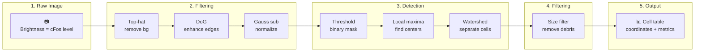

# Cell Detection Algorithm

How CellCounter identifies and counts cFos-positive cells.

---

## Overview

cFos is a nuclear protein that marks recently active neurons. Cell detection involves:

1. **Enhancing cell-like structures** — Filtering to highlight nuclei
2. **Separating foreground from background** — Thresholding
3. **Finding individual cell centers** — Local maxima detection
4. **Separating touching cells** — Watershed segmentation
5. **Filtering by size** — Removing debris and artifacts

The pipeline is designed for images where:
- Cells appear as bright, roughly spherical spots
- Background varies across the image
- Cells may touch or overlap

---

## The Pipeline Step by Step

### Step 1: Background Removal (Top-Hat Filter)

**Goal**: Remove large-scale illumination variations and uneven background.

**How it works**:
- Morphological opening with a large sphere removes bright objects
- Subtracting this from original leaves only small bright objects

```python
# Conceptually:
background = morphological_opening(image, radius=10)
cells = image - background
```

**Visual effect**:

| Before | After |
|--------|-------|
| Uneven illumination across field | Uniform background, bright cells stand out |
| Dark corners, bright center | Consistent baseline |

**Parameters**:
- `tophat_radius`: Radius of structuring element (voxels)
  - Default: 10
  - Smaller (5-8): For small cells or uneven background
  - Larger (12-20): For large cells or smooth background

---

### Step 2: Edge Enhancement (Difference of Gaussians)

**Goal**: Highlight cell boundaries and suppress noise.

**How it works**:
- Gaussian blur at small sigma (preserves cells)
- Gaussian blur at large sigma (preserves background)
- Subtract: edges remain, uniform regions cancel

```python
# Conceptually:
small_blur = gaussian_filter(image, sigma=1)
large_blur = gaussian_filter(image, sigma=4)
edges = small_blur - large_blur
```

**Why it helps**:
- Cells have strong edges → enhanced
- Background varies slowly → suppressed
- Small noise → smoothed out

**Visual effect**:

| Before | After |
|--------|-------|
| Whole cells bright, fuzzy boundaries | Edges emphasized, interiors uniform |
| Some noise visible | Noise reduced |

**Parameters**:
- `dog_sigma1`: Small Gaussian sigma (voxels)
  - Default: 1
  - Match to cell radius
- `dog_sigma2`: Large Gaussian sigma (voxels)
  - Default: 4
  - Typically 3-4 × sigma1

---

### Step 3: Adaptive Threshold Preparation

**Goal**: Handle varying background intensity across the image.

**How it works**:
- Large Gaussian smooths over cells
- Subtracts this slowly-varying background
- Result: normalized image suitable for global threshold

```python
# Conceptually:
background = gaussian_filter(image, sigma=101)
normalized = image - background
```

**Why it's needed**:
Some brain regions are brighter than others due to:
- Staining variation
- Tissue thickness differences
- Light sheet illumination falloff

---

### Step 4: Manual Thresholding

**Goal**: Create binary mask (cell / not-cell).

**How it works**:
- Pixels above threshold → foreground (1)
- Pixels below threshold → background (0)

```python
binary_image = filtered_image > threshold_value
```

**Visual effect**:

| Before | After |
|--------|-------|
| Grayscale, cells brighter | Black and white mask |
| Some dim cells | May be lost if threshold too high |
| Some bright debris | May be kept if threshold too low |

**Parameters**:
- `threshd_value`: Intensity threshold
  - Default: 60
  - Lower (40): More sensitive, more false positives
  - Higher (80): More stringent, fewer false positives

!!! tip "Finding the Right Threshold"
    Start with default (60), visualize with `combine_cellc()`, and adjust up/down by 10-20 until reaching good balance.

---

### Step 5-6: Label and Compute Volumes

**Goal**: Identify connected regions and measure their sizes.

**How it works**:
1. Connected component labeling: each contiguous foreground region gets unique ID
2. Union-Find algorithm merges labels across chunk boundaries
3. Volume computed for each component

**Challenge**: Cross-chunk connections

```
┌───────┬───────┐
│   1   │   1   │  ← Same cell spans both chunks!
│   1   │   1   │
├───────┼───────┤
│   2   │   3   │
│   2   │   3   │
└───────┴───────┘
    ↓ Union-Find
┌───────┬───────┐
│   A   │   A   │  ← Both labeled 'A'
│   A   │   A   │
├───────┼───────┤
│   B   │   C   │
│   B   │   C   │
└───────┴───────┘
```

The custom `UnionFind` class efficiently merges these labels.

---

### Step 7: Size Filtering #1

**Goal**: Remove obviously wrong objects (too small = noise, too large = artifacts).

```python
keep = (volume > min_threshd_size) & (volume < max_threshd_size)
```

**What it removes**:
- `min_threshd_size` (default: 100): Dust, noise pixels
- `max_threshd_size` (default: 9000): Clusters, artifacts

**Note**: This is a coarse filter. Fine-tuning happens after watershed.

---

### Step 8: Local Maxima Detection

**Goal**: Find the center point of each cell.

**How it works**:
- For each pixel, check if it's the maximum in local neighborhood
- Only keep maxima within valid regions (post-filter mask)

```python
for each pixel:
    neighborhood = image[pixel-radius:pixel+radius]
    if image[pixel] == max(neighborhood):
        mark as maxima
```

**Visual effect**:

| Before | After |
|--------|-------|
| Filtered threshold mask | Single-pixel markers at cell centers |
| Connected regions | One marker per cell |

**Parameters**:
- `maxima_radius`: Neighborhood size (voxels)
  - Default: 10
  - Smaller: More sensitive, may split cells
  - Larger: Less sensitive, may merge nearby cells

**Challenge**: Touching cells share a connected region but should have separate maxima.

---

### Step 9-10: Label Maxima and Watershed Segmentation

**Goal**: Separate touching cells.

**How watershed works**:
1. Treat inverted image as a terrain (dark = low, bright = high)
2. Maxima are "basins" that will collect "water"
3. Flood from each maxima simultaneously
4. Where floods meet → boundaries drawn

```
Image Intensity (inverted):
   ████████████
   ██a████b████   ← Two maxima (a, b) in valley
   ████████████
      ↑     ↑
   Basins that will flood upward

Watershed Result:
   AAAAAAA|BBBBBBB
   AAAAAAA|BBBBBBB  ← Boundary at midpoint
   AAAAAAA|BBBBBBB
```

**Why it works for cells**:
- Cells are brighter in center → form basins
- Touching cells have saddle point between → watershed boundary
- Separates overlapping nuclei

**Visual effect**:

| Before Watershed | After Watershed |
|------------------|-----------------|
| Single merged region for touching cells | Each cell has unique label |
| Cannot count individual cells | Cell count = number of labels |

---

### Step 11-12: Compute Watershed Volumes and Filter

**Goal**: Final size filtering on actual cells.

**Same as steps 5-7**, but applied to watershed segments:

```python
# Filter watershed cells
keep = (volume > min_wshed_size) & (volume < max_wshed_size)
```

**Parameters**:
- `min_wshed_size`: Minimum final cell size (default: 1)
- `max_wshed_size`: Maximum final cell size (default: 700)

These are the **most important** parameters for tuning:
- Too low: Dust included
- Too high: Real cells excluded
- Typical cFos nucleus: 50-300 voxels (at 1µm resolution)

---

### Step 13: Save Cells Table

**Goal**: Extract measurements for each detected cell.

For each valid cell:
- Center coordinates (z, y, x)
- Volume (voxels)
- Sum intensity (total fluorescence)
- Mean intensity (average brightness)

Output: Parquet file with columns:

| z | y | x | label | volume | sum_intensity | mean_intensity |
|---|---|---|-------|--------|---------------|----------------|
| 100 | 1500 | 2000 | 1 | 127 | 5432 | 42.8 |
| 102 | 1505 | 2010 | 2 | 98 | 4100 | 41.8 |
| ... | ... | ... | ... | ... | ... | ... |

---

## Algorithm Parameters Summary

| Parameter | Step | Default | Effect of Increase | Effect of Decrease |
|-----------|------|---------|-------------------|-------------------|
| `tophat_radius` | Background removal | 10 | More background removed | Less background removed |
| `dog_sigma1` | Edge detection | 1 | Larger features | Smaller features |
| `dog_sigma2` | Edge detection | 4 | Smoother edges | Sharper edges |
| `large_gauss_radius` | Adaptive thresh | 101 | More normalization | Less normalization |
| `threshd_value` | Thresholding | 60 | Fewer cells detected | More cells detected |
| `min_threshd_size` | Pre-filter | 100 | Fewer objects | More objects |
| `max_threshd_size` | Pre-filter | 9000 | Allows larger | Rejects larger |
| `maxima_radius` | Maxima detection | 10 | Fewer maxima | More maxima |
| `min_wshed_size` | Final filter | 1 | Rejects small | Keeps small |
| `max_wshed_size` | Final filter | 700 | Rejects large | Keeps large |

---

## Visual Summary



---

## Advantages of This Approach

1. **No training data needed** — Traditional image processing, not deep learning
2. **Interpretable parameters** — Each knob has clear meaning
3. **Fast on GPU** — All operations parallelize well
4. **Memory efficient** — Dask handles chunked processing
5. **Scales to large images** — Tested on ~90GB whole brains

---

## Limitations

1. **Assumes spherical cells** — Elongated cells may be split
2. **Requires staining quality** — Poor SNR defeats even best parameters
3. **Parameter tuning needed** — Not fully automatic
4. **No cell classification** — Can't distinguish cell types by morphology

For datasets where these limitations matter, deep learning approaches (StarDist, Cellpose) may be more appropriate, though they have their own trade-offs (training data, compute cost, GPU memory).
