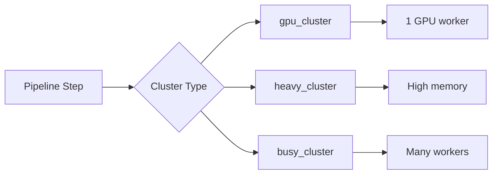

# Configuration

All pipeline parameters are stored in a single `config.json` file and accessed via `ProjConfig`.

## Accessing Configuration

```python
pipeline = Pipeline("/path/to/project")

# Read current config
config = pipeline.config
print(config.cell_counting.tophat_radius)

# Update and save
pipeline.update_config(
    cell_counting={"tophat_radius": 15},
)
```

## Configuration Structure

```python
class ProjConfig(BaseModel):
    # Zarr storage
    chunks: DimsConfig          # Chunk size (default: 500, 500, 500)

    # Tuning crop
    tuning_trim: DimsSliceConfig  # Crop for parameter tuning

    # Nested configs
    cluster: ClusterConfig      # Dask cluster settings
    reference: ReferenceConfig  # Atlas reference settings
    registration: RegistrationConfig  # Registration parameters
    cell_counting: CellCountingConfig  # Cell detection parameters
    visual_check: VisualCheckConfig    # Visual QC settings
```

## Key Parameters

### Registration

| Parameter | Default | Description |
|-----------|---------|-------------|
| `ref_orientation` | `(-2, 3, 1)` | Axis reorientation for atlas |
| `ref_trim` | `(None, None, None)` | Trim reference image |
| `downsample_rough` | `(3, 6, 6)` | Integer stride downsampling |
| `downsample_fine` | `(1.0, 0.6, 0.6)` | Gaussian zoom factors |
| `reg_trim` | `(None, None, None)` | Trim image for registration |
| `lower_bound` | `100` | Intensity clipping lower |
| `upper_bound` | `5000` | Intensity clipping upper |

### Cell Counting

| Parameter | Default | Description |
|-----------|---------|-------------|
| `tophat_radius` | `10` | Top-hat filter radius |
| `dog_sigma1` | `1` | DoG sigma 1 |
| `dog_sigma2` | `4` | DoG sigma 2 |
| `large_gauss_radius` | `101` | Adaptive threshold radius |
| `threshd_value` | `60` | Threshold value |
| `min_threshd_size` | `100` | Min object size (thresholded) |
| `max_threshd_size` | `9000` | Max object size (thresholded) |
| `maxima_radius` | `10` | Local maxima detection radius |
| `min_wshed_size` | `1` | Min object size (watershed) |
| `max_wshed_size` | `700` | Max object size (watershed) |

### Cluster

| Parameter | Default | Description |
|-----------|---------|-------------|
| `heavy_n_workers` | `1` | Workers for memory-intensive ops |
| `heavy_threads_per_worker` | `6` | Threads for heavy cluster |
| `busy_n_workers` | `4` | Workers for parallel ops |
| `busy_threads_per_worker` | `1` | Threads for busy cluster |

## Dask Clusters

The pipeline uses three cluster types:



- **GPU Cluster**: Cell counting operations with CuPy
- **Heavy Cluster**: Memory-intensive operations (watershed)
- **Busy Cluster**: I/O-bound operations (registration, mapping)
