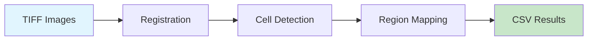

# CellCounter

Automated cFos cell counting and brain region mapping for whole-brain microscopy images.



## What it does

1. **Register** your microscopy images to a reference atlas (e.g., Allen Mouse Brain Atlas)
2. **Detect** cFos-positive cells using watershed segmentation
3. **Map** detected cells to anatomical brain regions

## Quick Start

```bash
# Install
uv sync

# Initialize atlas data
uv run cellcounter-init

# Create a new project
uv run cellcounter-make-project
```

## Features

- **GPU Acceleration** - CUDA support via CuPy for large images (~90GB)
- **Memory Efficient** - Dask-powered chunked processing
- **Configurable** - All parameters via Pydantic models
- **Visual QC** - Built-in visual check tools with napari

## Next Steps

<div class="grid cards" markdown>

-   :material-rocket-launch:{ .lg .middle } __Getting Started__

    ---

    Install and run your first analysis

    [:octicons-arrow-right-24: Installation](tutorials/installation.md)

-   :material-book-open-variant:{ .lg .middle } __Tutorials__

    ---

    Learn the workflow step by step

    [:octicons-arrow-right-24: Quick Start](tutorials/quickstart.md)

-   :material-tools:{ .lg .middle } __How-To Guides__

    ---

    Solve specific problems

    [:octicons-arrow-right-24: Batch Processing](how-to/batch.md)

-   :material-code-braces:{ .lg .middle } __API Reference__

    ---

    Browse the code documentation

    [:octicons-arrow-right-24: Pipeline API](reference/pipeline.md)

</div>
