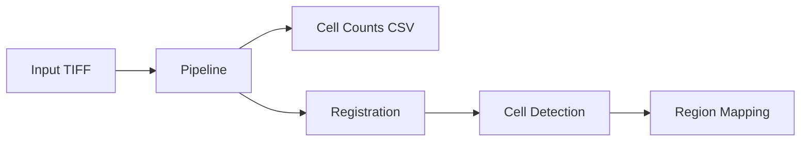

# Quick Start

Process your first microscopy image from TIFF to cell counts.

## Overview



## 1. Create a Project

```bash
uv run cellcounter-make-project
```

This creates a project directory with the required structure:

```
my_project/
├── config.json          # All pipeline parameters
└── cellcount/           # Processing outputs
    ├── raw.zarr/        # Converted image data
    ├── regresult.tiff   # Registration result
    └── cells_agg.csv    # Final cell counts
```

## 2. Configure Parameters

Edit `config.json` or update programmatically:

```python
from cellcounter import Pipeline

pipeline = Pipeline("/path/to/project")
pipeline.update_config(
    registration={
        "ref_orientation": {"z": -2, "y": 3, "x": 1},
        "downsample_rough": {"z": 3, "y": 6, "x": 6},
    },
    cell_counting={
        "tophat_radius": 10,
        "threshd_value": 60,
        "min_wshed_size": 1,
        "max_wshed_size": 700,
    },
)
```

## 3. Run the Pipeline

```python
from cellcounter import Pipeline

# Initialize
pipeline = Pipeline("/path/to/project")

# Run all steps
pipeline.run_pipeline("/path/to/image.tiff")

# Or run individual steps
pipeline.tiff2zarr("/path/to/image.tiff")
pipeline.reg_ref_prepare()
pipeline.reg_img_rough()
# ... etc
```

## 4. Check Results

Results are saved to `cells_agg.csv`:

| region_id | region_name | cell_count | avg_intensity |
|-----------|-------------|------------|---------------|
| 1         | isocortex   | 1523       | 245.3         |
| 2         | hippocampus | 892        | 198.7         |

## Pipeline Steps

### Registration (7 steps)

| Step | Method | Description |
|------|--------|-------------|
| 1 | `tiff2zarr` | Convert TIFF to chunked Zarr |
| 2 | `reg_ref_prepare` | Prepare reference atlas |
| 3 | `reg_img_rough` | Integer-stride downsampling |
| 4 | `reg_img_fine` | Gaussian zoom downsampling |
| 5 | `reg_img_trim` | Trim to region of interest |
| 6 | `reg_img_bound` | Apply intensity bounds |
| 7 | `reg_elastix` | Elastix registration |

### Cell Counting

```python
# 13 steps: filtering → thresholding → watershed → filtering
STEPS_CELL_COUNTING = (
    "tophat_filter",           # 1. Background subtraction
    "dog_filter",              # 2. Difference of Gaussians
    "adaptive_threshold_prep", # 3. Gaussian subtraction
    "threshold",               # 4. Manual thresholding
    "label_thresholded",       # 5. Label contiguous regions
    "compute_thresholded_volumes", # 6. Union-find volumes
    "filter_thresholded",      # 7. Size filtering
    "detect_maxima",           # 8. Local maxima detection
    "label_maxima",            # 9. Label maxima
    "watershed",               # 10. Watershed segmentation
    "compute_watershed_volumes", # 11. Watershed volumes
    "filter_watershed",        # 12. Size filtering
    "save_cells_table",        # 13. Extract cell measurements
)
```

### Mapping

```python
STEPS_MAPPING = (
    "transform_coords",  # Transform to atlas space
    "cell_mapping",      # Assign region IDs
    "group_cells",       # Aggregate by region
    "cells2csv",         # Export results
)
```

## GPU vs CPU Mode

```python
# GPU mode (default, recommended)
pipeline = Pipeline(proj_dir)
pipeline.set_gpu(enabled=True)

# CPU mode (fallback, may OOM on large images)
pipeline.set_gpu(enabled=False)
```

GPU mode uses CuPy for array operations. Falls back automatically if CUDA unavailable.

## Next Steps

- [Configuration Reference](../reference/config.md) - All tunable parameters
- [Visual QC](../how-to/visual-check.md) - Quality control tools
