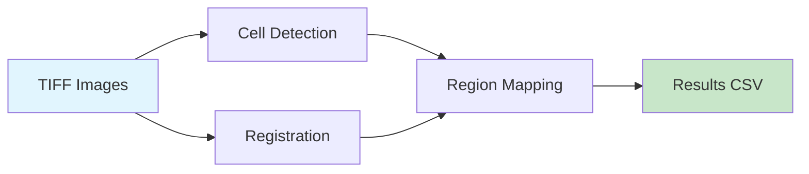

# Quick Start Tutorial

Process your first microscopy image from TIFF file to cell counts by brain region.

!!! tip "Prerequisites"
    Make sure you've completed the [Installation guide](installation.md) first.

---

## What We'll Do

By the end of this tutorial, you will:

1. Create a new project with the correct folder structure
2. Configure parameters for your specific image
3. Run image registration (align to brain atlas)
4. Tune cell detection parameters on a small crop
5. Run cell detection on the full image
6. Map cells to brain regions
7. Export results to CSV

---

## Overview

The pipeline has three main stages:



| Stage | What It Does | Time (GPU) |
|-------|-------------|------------|
| **Registration** | Converts TIFF, aligns image to Allen Atlas | 30-60 min |
| **Cell Detection** | Finds cFos+ cells using watershed segmentation | 20-40 min |
| **Region Mapping** | Assigns each cell to a brain region | 5-10 min |

---

## Step 1: Create a Project

Projects keep your data organized and store all processing parameters.

### Choose Your Workspace

Create a folder for your analysis. We'll use two folders:

```bash
# Folder containing your TIFF images
mkdir -p /path/to/your/data

# Folder where results will be saved
mkdir -p /path/to/your/analysis
```

### Create the Project

```bash
cd /path/to/your/analysis
uv run cellcounter-make-project
```

You'll see:
```
? Enter project name:  my_experiment
✓ Created project: my_experiment
```

This creates:

```
my_experiment/
├── config.json          # ← All parameters (we'll edit this)
└── cellcount/           # ← Where outputs will be saved
    ├── raw.zarr/        # Converted image
    ├── cells_agg.csv    # Final results
    └── ... (intermediate files)
```

!!! success "Checkpoint"
    You now have a project folder ready for processing.

---

## Step 2: Load and Configure Your Project

Start Python and load your project:

```python
from cellcounter import Pipeline

# Load the project
pipeline = Pipeline("/path/to/your/analysis/my_experiment")

# View current config
print(pipeline.config.cell_counting.threshd_value)  # Default: 60
```

### Understanding Your Image

Before configuring, you need to know:

1. **Image dimensions** (z, y, x in voxels)
2. **Resolution** (microns per voxel)
3. **Orientation** (how axes map to atlas)
4. **Intensity range**

Use ImageJ/Fiji or this quick Python check:

```python
import tifffile
img = tifffile.imread("/path/to/your/image.tiff")
print(f"Shape: {img.shape}")  # (z, y, x)
print(f"Dtype: {img.dtype}")  # uint16, uint32, etc.
print(f"Min/Max: {img.min()}, {img.max()}")
```

### Update Configuration

The most important parameters to adjust:

```python
pipeline.update_config(
    # Image chunking (affects memory usage)
    chunks={"z": 500, "y": 500, "x": 500},

    # Orientation: map your image axes to atlas
    # Use negative values to flip axes
    registration={
        "ref_orientation": {"z": -2, "y": 3, "x": 1},
        # -2 means: flip axis 2 (z), use as z
        #  3 means: use axis 3 (y) as y
        #  1 means: use axis 1 (x) as x
    },

    # Downsampling: adjust for your resolution
    # Whole-brain lightsheet often needs (3, 6, 6)
    registration={
        "downsample_rough": {"z": 3, "y": 6, "x": 6},
        "downsample_fine": {"z": 1.0, "y": 0.6, "x": 0.6},
    },

    # Cell counting parameters
    cell_counting={
        # Detection sensitivity (lower = more cells detected)
        "threshd_value": 60,

        # Cell size range (in voxels)
        "min_wshed_size": 1,    # Minimum cell size
        "max_wshed_size": 700,  # Maximum cell size

        # Background removal
        "tophat_radius": 10,
    },
)
```

!!! tip "Finding the Right Orientation"
    The Allen Atlas has axes (z=inferior-superior, y=anterior-posterior, x=left-right). Use napari to open your image and compare with the reference atlas to determine the correct mapping.

---

## Step 3: Convert TIFF to Zarr

CellCounter uses [Zarr](https://zarr.readthedocs.io/) for efficient chunked storage.

```python
# Convert your TIFF
pipeline.tiff2zarr("/path/to/your/image.tiff")
```

This creates `cellcount/raw.zarr/` with your image in chunked format.

!!! note "TIFF Variations"
    CellCounter supports:
    - Single multi-page TIFF files
    - Directories of single-plane TIFFs (will be stacked by natural sort order)

---

## Step 4: Run Registration

Registration aligns your image to the Allen Atlas. This step:
1. Prepares reference images
2. Downsamples your image to match atlas resolution
3. Runs elastix registration

```python
# Prepare reference (do once)
pipeline.reg_ref_prepare()

# Downsample steps
pipeline.reg_img_rough()    # Integer stride downsample (~5 min)
pipeline.reg_img_fine()     # Gaussian zoom (~2 min)
pipeline.reg_img_trim()     # Trim to region (~1 min)
pipeline.reg_img_bound()    # Clip intensity (~1 min)

# Register
pipeline.reg_elastix()      # Elastix registration (~20-30 min)
```

!!! success "Checkpoint"
    You now have a registered image aligned to the atlas. Verify with:
    ```python
    from cellcounter import VisualCheck

    vc = VisualCheck("/path/to/your/analysis/my_experiment")
    vc.combine_reg()  # Creates combined_reg.tiff for inspection
    ```

---

## Step 5: Tune Cell Detection

**Don't run on full image yet!** First, tune parameters on a small cropped region.

### Create Tuning Crop

```python
# Define crop region for tuning (choose a representative region with cells)
pipeline.update_config(
    tuning_trim={
        "z": {"start": 700, "stop": 800, "step": None},   # 100 z-slices
        "y": {"start": 1000, "stop": 3000, "step": None}, # 2000 y-pixels
        "x": {"start": 1000, "stop": 3000, "step": None}, # 2000 x-pixels
    }
)

# Create the tuning crop
pipeline.make_tuning_arr()
```

### Run Cell Counting on Tuning Crop

```python
# Use tuning=True to process only the crop
pipeline_tuning = Pipeline(
    "/path/to/your/analysis/my_experiment",
    tuning=True
)

# Run cell detection pipeline
pipeline_tuning.tophat_filter()              # Background removal
pipeline_tuning.dog_filter()                 # Edge enhancement
pipeline_tuning.adaptive_threshold_prep()    # Adaptive thresholding
pipeline_tuning.threshold()                  # Binary threshold
pipeline_tuning.label_thresholded()          # Label regions
pipeline_tuning.compute_thresholded_volumes() # Compute sizes
pipeline_tuning.filter_thresholded()         # Size filter #1
pipeline_tuning.detect_maxima()              # Find cell centers
pipeline_tuning.label_maxima()               # Label centers
pipeline_tuning.watershed()                  # Segment touching cells
pipeline_tuning.compute_watershed_volumes()  # Compute cell sizes
pipeline_tuning.filter_watershed()           # Size filter #2

# Visualize results
vc_tuning = VisualCheck(
    "/path/to/your/analysis/my_experiment",
    tuning=True
)
vc_tuning.combine_cellc()  # Creates combined file for inspection
```

Open `cellcount/tuning/combined_cellc.tiff` in napari to verify:
- Are cells being detected? (blue channel = thresholded, green = final cells)
- Are cells being split correctly? (watershed should separate touching cells)
- Are debris/dust particles filtered out? (adjust size filters)

### Iterate Until Satisfied

Adjust parameters and re-run tuning until detection looks good:

```python
# If too few cells detected, lower threshold
pipeline_tuning.update_config(cell_counting={"threshd_value": 50})

# If too many small noise artifacts, increase min size
pipeline_tuning.update_config(cell_counting={"min_wshed_size": 10})

# Re-run cell counting steps (overwrite=True to update)
pipeline_tuning.dog_filter(overwrite=True)
pipeline_tuning.threshold(overwrite=True)
# ... etc
```

!!! success "Checkpoint"
    You now have cell detection parameters that work for your data.

---

## Step 6: Run Full Cell Counting

Now run with `tuning=False` on the full image:

```python
pipeline_full = Pipeline(
    "/path/to/your/analysis/my_experiment",
    tuning=False
)

# Run same steps, now on full image (~20-40 min)
pipeline_full.tophat_filter()
pipeline_full.dog_filter()
pipeline_full.adaptive_threshold_prep()
pipeline_full.threshold()
pipeline_full.label_thresholded()
pipeline_full.compute_thresholded_volumes()
pipeline_full.filter_thresholded()
pipeline_full.detect_maxima()
pipeline_full.label_maxima()
pipeline_full.watershed()
pipeline_full.compute_watershed_volumes()
pipeline_full.filter_watershed()

# Extract cell measurements
pipeline_full.save_cells_table()
```

---

## Step 7: Map Cells to Brain Regions

```python
# Transform coordinates to atlas space
pipeline_full.transform_coords()

# Assign each cell to a brain region
pipeline_full.cell_mapping()

# Group cells by region and aggregate
pipeline_full.group_cells()

# Export to CSV
pipeline_full.cells2csv()
```

!!! success "Done!"
    Your results are in `cellcount/cells_agg.csv`

---

## Understanding Your Results

Open `cellcount/cells_agg.csv`:

| Column | Description |
|--------|-------------|
| `id` | Allen Atlas region ID |
| `name` | Brain region name |
| `acronym` | Short name (e.g., "CA1", "MOp") |
| `cell_count` | Number of cells in this region |
| `volume` | Total cell volume (voxels) |
| `sum_intensity` | Sum of fluorescence intensities |
| `avg_intensity` | Average intensity per cell |
| `voxel_intensity` | Intensity per voxel |

---

## Quick Reference: Common Issues

### "Not detecting any cells"
- Lower `threshd_value` (try 40, 30, 20...)
- Check image intensity range — is it very dim?
- Verify tuning crop has visible cFos+ cells

### "Detecting too many false positives"
- Increase `threshd_value`
- Increase `min_wshed_size` to filter small debris
- Adjust `tophat_radius` if background not removed

### "Cells not separated correctly"
- Increase `dog_sigma1` or `dog_sigma2` for better edge detection
- Check that detected maxima are inside cells

### "Registration looks wrong"
- Check `ref_orientation` — are axes mapped correctly?
- Verify `downsample_rough` matches your resolution
- Use `VisualCheck.combine_reg()` to diagnose

---

## Next Steps

- [Process multiple images](../how-to/batch.md) — Batch processing guide
- [Configure parameters](../how-to/configuration.md) — Detailed parameter reference
- [Visual QC](../how-to/visual-check.md) — Quality control tools
- [Understand the algorithm](../explanation/cell-detection.md) — How cell detection works
